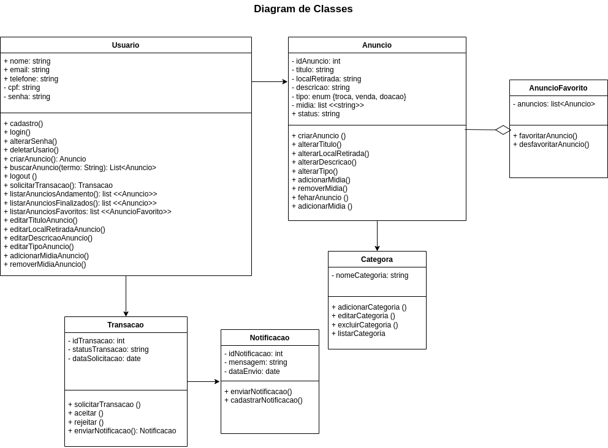

# 2.1.1.DiagramaDeClasses

## Introdução

## Metodologia

## Diagramas

Logo abaixo, segue diagramas de classe feitos pelos alunos. 

<!-- 

 -->
**Figura 1: Diagrama 1 de Classe do Sistema FCTEdesapega**

<iframe width="768" height="432" src="https://miro.com/app/live-embed/uXjVI6dlmE8=/?moveToViewport=-2223,-1083,4119,2211&embedId=539830411321" frameborder="0" scrolling="no" allow="fullscreen; clipboard-read; clipboard-write" allowfullscreen></iframe>

<em>Autores(as): <a href="https://github.com/arthur-suares">Arthur Suares</a> e <a href="https://github.com/Marianannn">Mariana Letícia</a>, 2025.</em>

**Figura 2: Diagrama 2 de Classe do Sistema FCTEdesapega**

*Autores(as): [Eduarda Tavares](https://github.com/erteduarda) e [Renata Quadros](https://github.com/RenataKurzawa), 2025* 

[🎥 Vídeo da realização do diagrama de classe: Eduarda e Renata](https://unbbr.sharepoint.com/:v:/s/Arquiteturaedesenhodesoftwaregrupo06/EXNngGZnYAZDjbFbL_dXe4QBgswO4_Dr5Qld9Xr_bdnKfg?e=ZhZWth)

## Análise de resultados

Conforme pôde ser visualizado nos diagramas de classe apresentados, foi possível identificar abstrações da realidade através das classes que sugerem propostas relevantes ao objetivo requerido com esses diagramas. À nível de modelagem, os diagramas possuem suas respectivas diferenças porém são concepções que valem a pena de serem agregadas em um projeto.

## Histórico de Versão

    <table>
        <tr>
            <th>Data</th>
            <th>Versão</th>
            <th>Descrição</th>
            <th>Autor</th>
            <th>Data da Revisão</th>
            <th>Revisor</th>
            <th>Descrição de Revisão</th>
        </tr>
        <tr>
            <td>08/05/2025</td>
            <td>1.0</td>
            <td>Acrescentando diagrama de classes feitos por Arthur e Mariana</td>
            <td><a href="https://github.com/arthur-suares">Arthur Suares</a> <a href="https://github.com/Marianannn">Mariana Letícia</a></td>
            <td>08/05/2025</td>
            <td><a href="https://github.com/arthur-suares">Arthur Suares</a></td>
            <td>Foi revisado o diagrama de classes da dupla que faço parte, seu posicionamento no documento e se era possível acessa-lo</td>
        </tr>
        <tr>
            <td>08/05/2025</td>
            <td>1.1</td>
            <td>Acrescentando diagrama de classes feito por Renata e Eduarda; Acrescentando link da gravação fazendo o diagrama de classes feito pela dupla</td>
            <td><a href="https://github.com/RenataKurzawa">Renata Quadros</a> <a href="https://github.com/erteduarda">Eduarda Tavares</a></td>
            <td>08/05/2025</td>
            <td><a href="https://github.com/RenataKurzawa">Renata Quadros</a></td>
            <td>Foi revisado o diagrama de classes da dupla que faço parte, seu posicionamento no documento e se era possível acessa-lo</td>
        </tr>
        <tr>
            <td>08/05/2025</td>
            <td>2.0</td>
            <td>Acrescentando Análise de resultados</td>
            <td><a href="https://github.com/Marianannn">Mariana Letícia</a></td>
            <td>08/05/2025</td>
            <td><a href="https://github.com/arthur-suares">Arthur Suares</a></td>
            <td>Foi verificado se a análise de resultados foi realizada conforme o esperado pela disciplina.
        </tr>
    </table>

