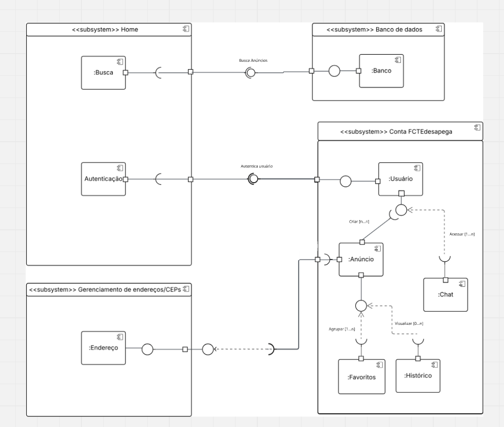
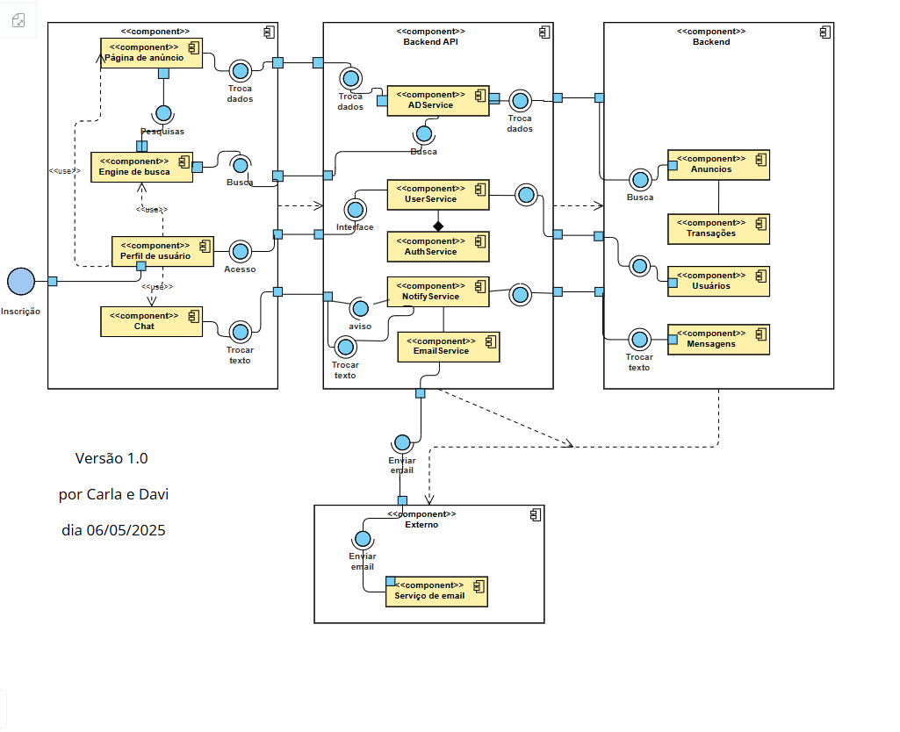

# 2.1.2.DiagramaDeComponentes

## Introdução

Após definir requisitos, metas e um público alvo para o site proposto, o mesmo precisava ter sua lógica de construção devidamente arquitetada. O diagrama de componentes é um método de ilustração visual que define como as classes deverão se organizar através de componentes. Assim destacamos a utilização de cada módulo em produção.

## Metodologia

Foi definida uma divisão clara de três equipes dedicadas para realização destes diagramas cada qual expondo sua visão de componentização e organização do produto. 

Os diagramas foram definidos de acordo com as regras de componentes, onde os componentes são divididos entre si, podendo alocar componentes menores dentro de si e recebendo e/ou enviando informações para outra parte do sistema executar sua lógica. Também é evidenciado dependências e a existencia de "vias de mão dupla" nos diagramas, com componentes que exibem no front (visual) informações da base de dados bem como os enviam a base. 

As duplas ficaram responsáveis pela revisão das próprias tabelas em parte do tempo, deixando a revisão final para montagem da documentação no deploy.

A primeira edição foi criada pelos Alunos Arthur e Mariana em conjunto, a divisão de tarefas e pesquisa entre si proporcionou uma edição visualmente diferente mas proporcional em usabilidade as outras mostradas nessa página, evidenciado as diferenças lógicas para melhor escolha de um modelo mais próximo as necessidades do projeto. 

## Diagramas

Logo abaixo, segue diagramas de componentes feitos pelos alunos.

A primeira imagem foi produzida por Arthur e Mariana
   

<em>Autores(as): <a href="https://github.com/arthur-suares">Arthur Suares</a> e <a href="https://github.com/Marianannn">Mariana Letícia</a>, 2025.</em>

A segunda imagem foi produzida por Carla e Davi
 

<em>Autores(as): <a href="https://github.com/Jagaima">Davi Nobre</a> e <a href="https://github.com/ccarlaa">Carla Clementino</a>, 2025.</em>

## Histórico de Versão

    <table>
        <tr>
            <th>Data</th>
            <th>Versão</th>
            <th>Descrição</th>
            <th>Autor</th>
            <th>Data da Revisão</th>
            <th>Revisor</th>
            <th>Descrição de Revisão</th>
        </tr>
        <tr>
            <td>08/05/2025</td>
            <td>1.0</td>
            <td>Acrescentando diagrama de componentes feitos por Arthur e Mariana</td>
            <td><a href="https://github.com/arthur-suares">Arthur Suares</a> <a href="https://github.com/Marianannn">Mariana Letícia</a></td>
            <td>08/05/2025</td>
            <td><a href="https://github.com/arthur-suares">Arthur Suares</a></td>
            <td>Foi revisado o diagrama de componentes da dupla que faço parte, seu posicionamento no documento e se era possível acessa-lo</td>
        </tr>
    </table>

