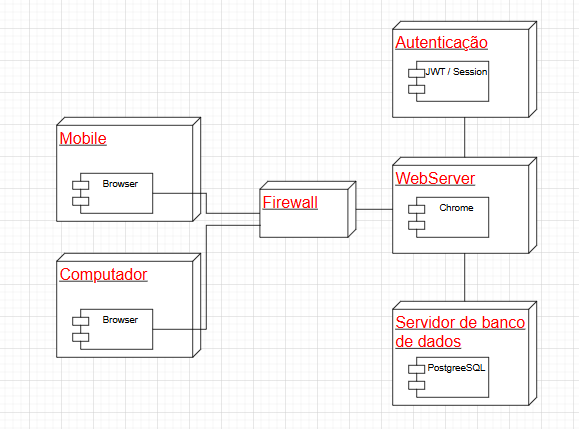

# Diagrama De Implantação

## Introdução

O diagrama de implantação tem como principal objetivo representar a arquitetura física do sistema, detalhando como os componentes de software são distribuídos entre os recursos de hardware. Este tipo de diagrama é essencial para visualizar a infraestrutura necessária para a execução da aplicação, incluindo servidores, dispositivos, conexões de rede e os artefatos implantados em cada nó. No contexto do presente projeto, o diagrama de implantação foi desenvolvido para ilustrar a distribuição dos elementos do sistema “Repassei” em seu ambiente operacional, evidenciando a comunicação entre os nós e a alocação de serviços e componentes.

## Metodologia

Para a construção do diagrama de implantação, foram seguidas as diretrizes da linguagem UML (Unified Modeling Language), com foco na representação da arquitetura física do sistema. Inicialmente, foi realizada uma análise dos componentes principais da aplicação, bem como da infraestrutura necessária para sua execução, incluindo servidores, serviços externos, e dispositivos envolvidos.

Com base nessa análise, identificaram-se os nós (nodes), artefatos de software e os relacionamentos entre eles. A definição das tecnologias utilizadas, como servidores de aplicação, banco de dados, serviços web e APIs, também orientou a estrutura do diagrama. A modelagem foi realizada utilizando ferramentas específicas de diagramas UML, que garantiram clareza e padronização na representação dos elementos.

A metodologia adotada priorizou a fidelidade à infraestrutura planejada para o ambiente de produção, buscando representar de forma precisa como os módulos do sistema serão distribuídos, implantados e integrados no ambiente real. Essa abordagem contribui para o entendimento da complexidade do sistema e para o planejamento adequado da sua infraestrutura de implantação.

## Primeiro Diagrama de Implantação

O diagrama desenvolvido está apresentado na Figura abaixo, sendo também disponibilizado para consulta através do seguinte link: [Diagrama de Implantação](https://unbbr.sharepoint.com/:v:/s/IHC_reunies/Eayuds_gxwlAu6gVmxmHiUgBvsHg7tZov5s6ULWK_8CPnw?e=c5Op3U&nav=eyJyZWZlcnJhbEluZm8iOnsicmVmZXJyYWxBcHAiOiJTdHJlYW1XZWJBcHAiLCJyZWZlcnJhbFZpZXciOiJTaGFyZURpYWxvZy1MaW5rIiwicmVmZXJyYWxBcHBQbGF0Zm9ybSI6IldlYiIsInJlZmVycmFsTW9kZSI6InZpZXcifX0%3D)

    
<b>Figura 1:</b> Diagrama de implantação

.drawio.png)

<em>Autor(a): Karolina Vieira e Paola Nascimento, 2025.</em>

## Análise e Resultados

### Visão geral
O diagrama de implantação apresentado descreve a infraestrutura física e lógica do sistema Desapega, uma plataforma web voltada à publicação e gestão de anúncios classificados. O diagrama foca na comunicação entre os elementos principais do sistema — desde o acesso do usuário até o processamento e armazenamento dos dados —, evidenciando os principais componentes e suas interações.

### 1. Dispositivo de Acesso – Cliente
O acesso ao sistema é realizado por meio de navegadores web instalados em dispositivos dos usuários, como computadores, notebooks ou smartphones. No diagrama, essa camada é representada pelo nó “End User Client”, que contém o componente Browser, responsável por enviar requisições ao servidor através da internet, utilizando protocolo HTTP ou HTTPS.

### 2. Camada de Segurança – Firewall
Entre o cliente e os serviços da aplicação, há um firewall, que atua como uma barreira de proteção. Ele é responsável por inspecionar o tráfego de rede, bloqueando requisições maliciosas e permitindo apenas comunicações seguras com o servidor back-end. Essa camada é essencial para garantir a segurança da aplicação e a integridade dos dados trafegados.

### 3. Webserver – Servidor de Aplicação
O Webserver representa o servidor onde está implantada a REST API do back-end, responsável por receber e processar as requisições dos navegadores dos usuários. Ele serve como ponto de integração entre a interface do cliente e os serviços internos, fazendo a mediação entre os dados solicitados e os processamentos necessários.

### 4. Servidor de Banco de Dados
O sistema conta com um servidor de banco de dados dedicado, que utiliza o PostgreSQL como sistema gerenciador. Este componente é responsável por armazenar todas as informações essenciais ao funcionamento do sistema, como dados de usuários, anúncios, sessões e registros de transações. A comunicação entre o Webserver e o Banco de Dados ocorre por meio de socket local/TCPIP, indicando que ambos estão na mesma rede local ou máquina virtualizada.

## Segundo Diagrama de Implantação

O diagrama desenvolvido pode ser visualizado abaixo, também disponível em [Diagrama de Implantação](https://drive.google.com/file/d/1j3jGrJt0l1KTBh5e37b00h368Pma4eXF/view?usp=drive_link):

  
   
  <i>Figura 2: Diagrama de Implantação do Sistema Desapega. Autor: Gabriel.</i>

---

## Análise e Resultados

### Visão Geral

O diagrama de implantação apresentado descreve a infraestrutura lógica e física responsável pelo funcionamento do sistema **Desapega**, plataforma voltada à gestão e exibição de anúncios classificados. Ele representa os componentes envolvidos na entrega do serviço aos usuários finais, destacando a comunicação entre os dispositivos de acesso, as camadas de segurança, os servidores responsáveis pelo processamento das requisições e os sistemas de persistência e autenticação de usuários.

---

### 1. Dispositivos de Acesso

Os usuários podem acessar o sistema por meio de dois dispositivos principais:

* **Mobile**: Representando smartphones e tablets.
* **Computador**: Representando desktops e notebooks.

Ambos os dispositivos utilizam navegadores web como ponto de entrada para o sistema, viabilizando a comunicação via protocolo HTTP(s) com os servidores.

---

### 2. Camada de Segurança – Firewall

A camada de segurança é composta por um **firewall**, responsável por filtrar o tráfego de entrada e saída entre os dispositivos dos usuários e os servidores da aplicação. Essa camada garante a proteção contra acessos indevidos e ataques, permitindo apenas comunicações legítimas com os serviços do sistema.

---

### 3. WebServer

O **WebServer** é o ponto de recepção das requisições oriundas dos navegadores. Ele é responsável por servir os recursos da aplicação, tais como páginas HTML, arquivos estáticos e APIs REST. O componente está diretamente conectado ao navegador dos clientes e interage com os demais servidores internos para fornecer os dados necessários ao funcionamento da plataforma.

---

### 4. Servidor de Autenticação

O servidor de autenticação é responsável pela validação da identidade dos usuários. O diagrama indica o suporte a dois mecanismos:

* **JWT (JSON Web Token)**: Utilizado para autenticação stateless, adequado a sistemas modernos e distribuídos.
* **Session-Based Authentication**: Autenticação baseada em sessões, armazenadas no servidor, oferecendo simplicidade e controle mais direto de validade.

Este servidor atua em conjunto com o WebServer para assegurar que apenas usuários autenticados tenham acesso aos recursos protegidos da plataforma.

---

### 5. Servidor de Banco de Dados

A base de dados do sistema é armazenada em um servidor dedicado que utiliza o **PostgreSQL**, um sistema gerenciador de banco de dados relacional de alto desempenho e confiabilidade. Esse servidor é responsável pela persistência de todas as informações do sistema, como dados de usuários, anúncios publicados, interações e histórico de negociações.

---

## Conclusão

O diagrama de implantação do sistema Desapega reflete uma arquitetura distribuída, segura e escalável. A separação clara entre os componentes de autenticação, web e banco de dados permite a especialização de serviços, facilitando a manutenção, o monitoramento e a escalabilidade da aplicação. O uso de firewall e autenticação reforça as boas práticas de segurança da informação, enquanto a adoção de PostgreSQL garante robustez no armazenamento dos dados.

---

## Referências

> UML Deployment Diagrams Overview. Disponível em: [https://www.uml-diagrams.org/deployment-diagrams.html](https://www.uml-diagrams.org/deployment-diagrams.html). Acesso em: 08 mai. 2025.

---

## Histórico de Versão

    <table>
        <tr>
            <th>Data</th>
            <th>Versão</th>
            <th>Descrição</th>
            <th>Autor</th>
            <th>Data da Revisão</th>
            <th>Revisor</th>
            <th>Descrição de Revisão</th>
        </tr>
        <tr>
            <td>08/05/2025</td>
            <td>1.0</td>
            <td>Adição do diagrama de implantação</td>
            <td><a href="https://github.com/GabrielSMonteiro">Gabriel Monteiro</a></td>
            <td>08/05/2025</td>
            <td></td>
            <td></td>
        </tr>
        <tr>
            <td>08/05/2025</td>
            <td>1.1</td>
            <td>A introdução, a descrição da metodologia adotada e o primeiro diagrama de implantação foram adicionadas</td>
            <td><a href="https://github.com/karolina91">Karolina Vieira</a></td>
            <td>08/05/2025</td>
            <td>Paola Nascimento</td>
            <td>Foi revisada a introdução, o diagrama de implantação da figura 1, assim como a sessão "Análise e Resultados" referente ao diagrama em questão, os links e a imagem também foram revisados.</td>
            
        </tr>
    </table>

