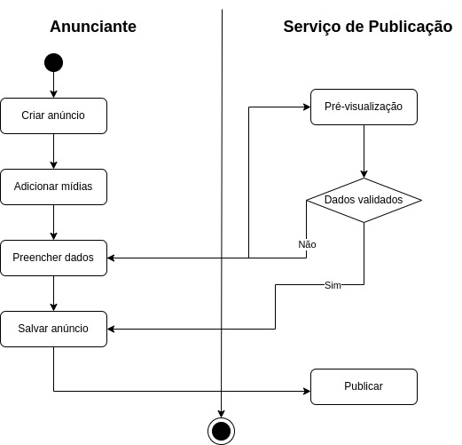

# 2.2.2.DiagramaDeAtividades

## Introdução

## Metodologia

## Diagramas
Logo abaixo se encontram os diagramas de atividades realizados.

**Figura 1: Diagrama de Atividade: Criar Anúncio**

*Autores(as): [Eduarda Tavares](https://github.com/erteduarda) e [Renata Quadros](https://github.com/RenataKurzawa), 2025* 

[🎥 Vídeo da realização do diagrama de atividade: Eduarda e Renata](https://unbbr.sharepoint.com/:v:/s/Arquiteturaedesenhodesoftwaregrupo06/EaONJKTDp_BGteBPuO7KI_IBdm7rrywcjQb-CzW-PcBSRg?e=XMSfet)

## Histórico de Versão

    <table>
        <tr>
            <th>Data</th>
            <th>Versão</th>
            <th>Descrição</th>
            <th>Autor</th>
            <th>Data da Revisão</th>
            <th>Revisor</th>
            <th>Descrição de Revisão</th>
        </tr>
        <tr>
            <td>08/05/2025</td>
            <td>1.0</td>
            <td>Acrescentando diagrama de atividade (criar anúncio) feito por Renata e Eduarda; adicionando link da gravação fazendo o diagrama</td>
            <td><a href="https://github.com/RenataKurzawa">Renata Quadros</a> <a href="https://github.com/erteduarda">Eduarda Tavares</a></td>
            <td>08/05/2025</td>
            <td><a href="https://github.com/RenataKurzawa">Renata Quadros</a>  e <a href="https://github.com/erteduarda">Eduarda Tavares</a></td>
            <td>Foi revisado o diagrama de atividade da dupla que faço parte, seu posicionamento no documento e se era possível acessa-lo</td>
        </tr>
    </table>

