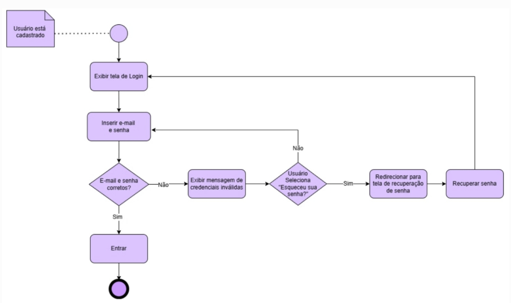

# 2.2.2.Diagrama De Atividades

## Introdução
O diagrama de atividades é um tipo de diagrama da UML utilizado para representar o fluxo de trabalho ou a sequência de ações em um determinado processo. Ele descreve como as atividades se iniciam, quais decisões são tomadas e os diferentes caminhos que podem ser seguidos, permitindo visualizar, de forma clara e lógica, o comportamento de um sistema ou processo de negócio.

Esses diagramas utilizam elementos visuais como ações, decisões, ramificações e objetos para representar as etapas e escolhas dentro do processo. Permite detalhar desde tarefas simples até fluxos complexos, tornando-se uma ferramenta essencial na análise e na remodelação de processos.

## Metodologia
A partir dos requisitos que foram levantados pela equipe e também a partir do protótipo de alta fidelidade feito por Carla de Araujo, as alunas Daniela, Eduarda e Renata elaboraram os diagramas de atividade. Foram usadas diversas ferramentas durante a elaboração dos diagramas como miro, lucichart, draw.io, entre outros.

## Diagramas
Logo abaixo se encontram os diagramas de atividades realizados.

**Figura 1: Diagrama de Atividade: Criar Anúncio**

*Autores(as): [Eduarda Tavares](https://github.com/erteduarda) e [Renata Quadros](https://github.com/RenataKurzawa), 2025* 

[🎥 Vídeo da realização do diagrama de atividade: Eduarda e Renata](https://unbbr.sharepoint.com/:v:/s/Arquiteturaedesenhodesoftwaregrupo06/EaONJKTDp_BGteBPuO7KI_IBdm7rrywcjQb-CzW-PcBSRg?e=XMSfet)

## Análise de Resultados

O diagrama de atividade "Criar Anúncio" ilustra o fluxo de ações necessárias para que um anunciante possa criar e publicar um anúncio. O processo começa com a criação do anúncio, seguido pela adição de mídias e preenchimento de dados. Após a pré-visualização, o sistema valida os dados. Se os dados não forem validados, o anunciante deve preencher os dados novamente. Caso contrário, o anúncio é salvo e publicado. Este diagrama ajuda a identificar possíveis gargalos e otimizar o processo de criação de anúncios.

**Figura 2: Diagrama de Atividade: Login**

*Autora: [Daniela Alarcão](https://github.com/danialarcao), 2025* 

## Análise de Resultados

O diagrama de atividade "Login" ilustra o fluxo de ações para que o usuário consiga logar em sua conta, utilizando suas credenciais que foram inicialmente cadastradas. O fluxo é simples, principalmente nos casos em que o usuário lembra corretamente de sua senha. Caso ele não lembre, o fluxo se desdobra no processo de recuperação de senha. Ao recuperar a senha, o usuário retorna ao início do fluxo, inserindo seu e-mail e sua senha novamente. Esse diagrama é importante, uma vez que o login é tarefa indispensável para o funcionamento do sistema. 

## Referências Bibliograficas

> 1. Booch, G., Rumbaugh, J., & Jacobson, I. (2005). Unified Modeling Language User Guide. Addison-Wesley Professional.
> 2. Fowler, M. (2004). UML Distilled: A Brief Guide to the Standard Object Modeling Language. Addison-Wesley Professional.
> 3. LUCIDCHART. O que é diagrama de atividades UML. Disponível em: https://www.lucidchart.com/pages/pt/o-que-e-diagrama-de-atividades-uml. Acesso em: 7 de maio 2025.

## Histórico de Versão

    <table>
        <tr>
            <th>Data</th>
            <th>Versão</th>
            <th>Descrição</th>
            <th>Autor</th>
            <th>Data da Revisão</th>
            <th>Revisor</th>
            <th>Descrição de Revisão</th>
        </tr>
        <tr>
            <td>08/05/2025</td>
            <td>1.0</td>
            <td>Acrescentando diagrama de atividade (criar anúncio) feito por Renata e Eduarda; adicionando link da gravação fazendo o diagrama</td>
            <td><a href="https://github.com/RenataKurzawa">Renata Quadros</a> <a href="https://github.com/erteduarda">Eduarda Tavares</a></td>
            <td>08/05/2025</td>
            <td><a href="https://github.com/RenataKurzawa">Renata Quadros</a>  e <a href="https://github.com/erteduarda">Eduarda Tavares</a></td>
            <td>Foi revisado o diagrama de atividade da dupla que faço parte, seu posicionamento no documento e se era possível acessa-lo</td>
        </tr>
        <tr>
            <td>08/05/2025</td>
            <td>1.1</td>
            <td>Acrescentando análise dos resultados</td>
            <td><a href="https://github.com/erteduarda">Eduarda Tavares</a></td>
            <td>08/05/2025</td>
            <td><a href="https://github.com/RenataKurzawa">Renata Quadros</a></td>
            <td>Foi revisado o diagrama de atividade da dupla que faço parte, seu posicionamento no documento e se era possível acessa-lo</td>
        </tr>
        <tr>
            <td>08/05/2025</td>
            <td>1.2</td>
            <td>Acrescentando diagrama de atividade (criar login)</td>
            <td><a href="https://github.com/danialarcao">Daniela Alarcão</a></td>
            <td>08/05/2025</td>
            <td><a href="https://github.com/GabrielSMonteiro">Gabriel Monteiro</a></td>
            <td>Foi revisado o diagrama de atividade da Daniela, evidenciando o fluxo lógico de atividades e o padrão estabelecido</td>
        </tr>
         <tr>
            <td>08/05/2025</td>
            <td>1.3</td>
            <td>Acrescentando Introdução, Metodologia e Referência</td>
            <td><a href="https://github.com/danialarcao">Daniela Alarcão</a></td>
            <td>08/05/2025</td>
            <td><a href="https://github.com/GabrielSMonteiro">Gabriel Monteiro</a></td>
            <td>Foi revisado o detalhamento da introdução, desenvolvimento e da metodologia destacada, considerando a congruência com o projeto.</td>
        </tr>
    </table>

