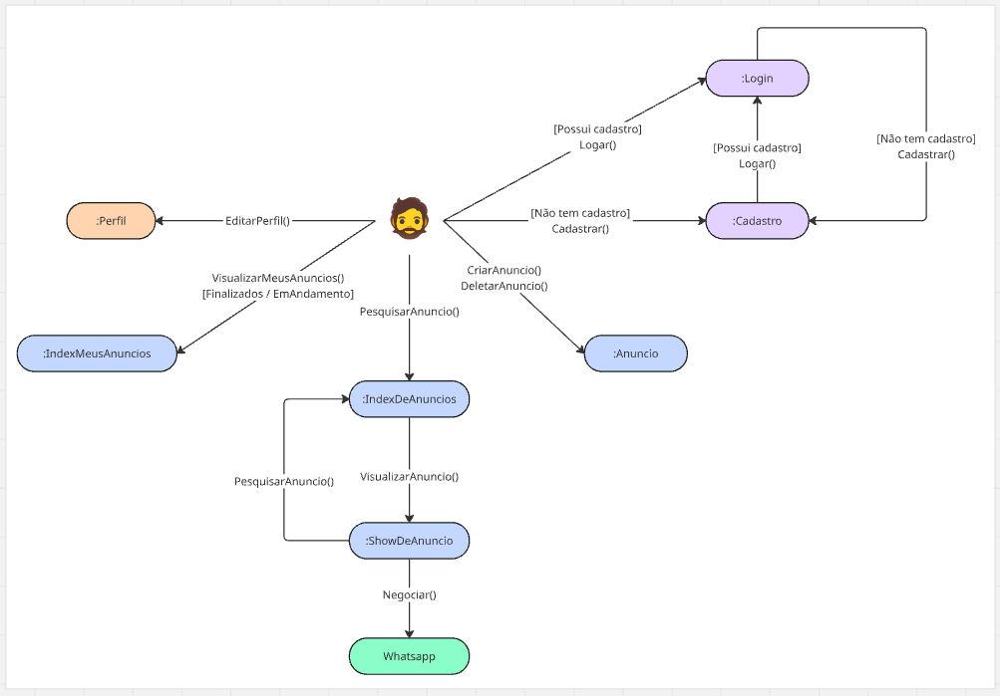

## Introdução 

O diagrama de comunicação é uma versão de diagrama visual que em sua essência representa o ato de recebimento de dados entre o ator e o caso de uso. Em vez de atividades comuns, esses diagramas utilizam quadros (frames) que representam interações específicas. Existem dois tipos principais de quadros: os frames de interação, que incorporam outros diagramas de interação da UML (como diagramas de sequência), e os frames de ocorrência de interação, que representam atividades ou operações a serem executadas.

## Metodologia

Conforme organizado em conjunto, foi definido um conjunto de duplas a se trabalhar nesta versão, assim podendo apresentar versões diferentes de artefatos necessários para o desenvolvimento do projeto. 
A divisão de tarefas e pesquisa entre si proporcionou uma edição visualmente diferente mas proporcional, evidenciado as diferenças lógicas para melhor escolha de um modelo mais próximo as necessidades do projeto. 

## Diagrama de Comunicação

O diagrama desenvolvido pode ser visualizado abaixo:

<!-- 

  
   
  <i>Figura 1: Diagrama de Comunicação do Sistema Desapega. Autor: Carla Clementino.</i>

 -->

## Análise e Resultados

Visão Geral:

O diagrama representa o fluxo de interação do usuário em um sistema de gerenciamento de anúncios. Ele apresenta as ações principais, como login, cadastro, criação de anúncios, visualização de anúncios, perfil do usuário e negociação via WhatsApp. Os elementos estão organizados de forma a guiar o usuário desde o cadastro até a negociação de um anúncio.

**1. Login e Cadastro:**

Os componentes de Login e Cadastro estão posicionados no canto superior direito do diagrama, indicando que essas ações são o ponto de entrada para o sistema. O usuário tem a opção de se cadastrar ou realizar o login caso já possua cadastro.

**2. Perfil e Gerenciamento de Anúncios:**

O componente de Perfil está isolado no canto esquerdo e é acionado pela ação "EditarPerfil()". Isso leva o usuário à tela onde ele pode editar suas informações pessoais.

O índice de anúncios ("IndexDeAnuncios") é o ponto central do sistema. A partir dele, o usuário pode visualizar todos os anúncios e acessar o detalhe de cada um através do componente "ShowDeAnuncio".

**3. Popover de Delete:**

A ação de deletar um anúncio foi adicionada no fluxo, conectando o "Anuncio" ao popover de delete. Esse popover apresenta opções de confirmação ou cancelamento da ação de exclusão.

**4. WhatsApp e Negociação:**

Após visualizar um anúncio, o usuário tem a opção de negociar via WhatsApp, indicado por um elemento verde. Isso demonstra que a negociação ocorre fora do sistema, direcionando o usuário para um canal externo.

## Referências

> UML Communication Diagrams Overview. Disponível em: [https://www.uml-diagrams.org/communication-diagrams.html](https://www.uml-diagrams.org/communication-diagrams.html). Acesso em: 08 mai. 2025.

> LARMAN, Scott. The Object Primer: Agile Model Driven Development with UML 2. 3. ed. Upper Saddle River: Prentice Hall, 2005. Cap. 11. Acessado através do site </https://agilemodeling.com/artifacts/interactionOverviewDiagram.htm>  ás 00;30 do dia 08 mai. 2025

## Histórico de Versão

    <table>
        <tr>
            <th>Data</th>
            <th>Versão</th>
            <th>Descrição</th>
            <th>Autor</th>
            <th>Data da Revisão</th>
            <th>Revisor</th>
            <th>Descrição de Revisão</th>
        </tr>
        <tr>
            <td>08/05/2025</td>
            <td>1.0</td>
            <td>Criação do documento e adição do diagrama de comunicação</td>
            <td><a href="https://github.com/CarlaClementino">Carla Clementino</a></td>
            <td>08/05/2025</td>
            <td><a href="https://github.com/Jagaima">Davi Nobre</a></td>
            <td>Neste momento minha revisão se baseou em analisar o texto redigido para a análise ao fim do documento, uma vez que ele é relativamente grande e de fácil sucetibilidade ao erro. Eu li o texto e corrigi o que acredito ser algumas concordâncias para versões mais agradáveis, no mais o texto estava ótimo e condizente. Tabmém adicionei a bibliografia utilizada por mim e minha dupla. </td>
        </tr>
        <tr>
            <td>08/05/2025</td>
            <td>1.0</td>
            <td>Criação da introdução e metodologia bem como adição de mais bibliografia</td>
            <td><a href="https://github.com/Jagaima">Davi Nobre</a></td>
            <td>08/05/2025</td>
            <td><a href="https://github.com/CarlaClementino">Carla Clementino</a></td>
            <td>    A revisão consistiu em verificar a padronização da bibliografica como ajustes gerais no texto do documento, averiguando a coerência das informações apresentadas</td>
        </tr>
    </table>

