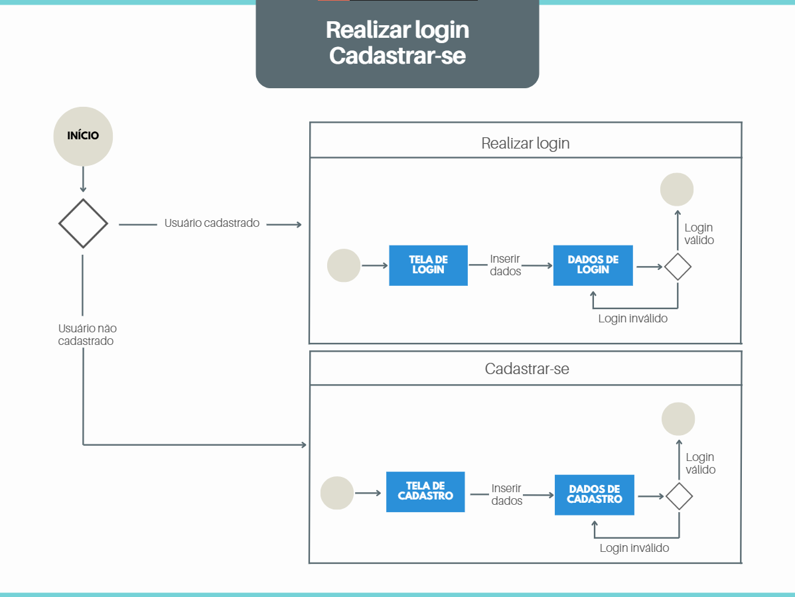
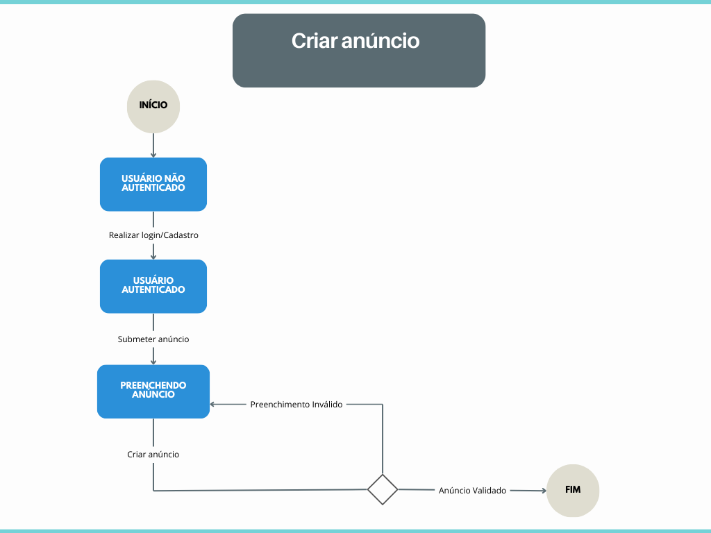
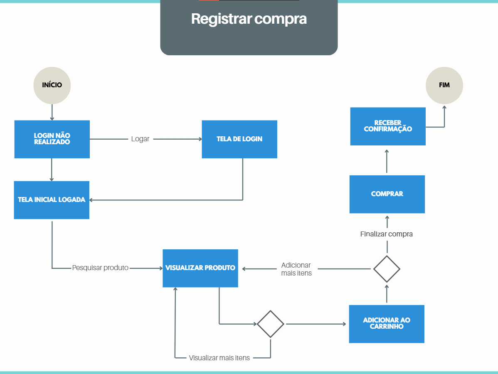

# Diagrama de Estados

## Introdução

O diagrama de estados é utilizado para representar como um objeto ou funcionalidade se comporta ao longo do tempo, respondendo a eventos e transições. Ele ajuda a entender de forma clara o fluxo de ações dentro de um sistema. No projeto FCTE Desapega, esse tipo de diagrama foi aplicado para representar três funcionalidades principais: fazer login/cadastro, criar anúncio e realizar uma compra.

## Metodologia

Para a criação dos diagramas, utilizamos a ferramenta Canva, que possibilitou a elaboração de fluxos com boa visualização e organização. Os modelos foram baseados nos princípios da UML, focando em máquinas de estados comportamentais, ideais para representar a lógica de ações do usuário dentro do sistema.

## Diagramas

    
<b>Figura 1:</b> Diagrama de estado - Fazer login/cadastro

<em>Autor(a): Paola, 2025.</em>

    
<b>Figura 2:</b> Diagrama de estado - Criar anúncio

<em>Autor(a): Karolina, 2025.</em>

    
<b>Figura 3:</b> Diagrama de estado - Realizar compra

<em>Autor(a): Paola, 2025.</em>

## Análise e Resultados

### **Realizar Login/Cadastre-se**

O diagrama de estados da funcionalidade Realizar login / Cadastrar-se demonstra o fluxo inicial de autenticação do usuário no sistema. Ele detalha tanto o caminho para usuários já cadastrados quanto para novos usuários, abordando o processo de inserção e validação dos dados necessários para o acesso à plataforma.

### **Análise dos estados e transições**

O fluxo se inicia com a decisão sobre o status do usuário: se já possui cadastro, segue para a tela de login; caso contrário, é direcionado à tela de cadastro.

- Em ambas as situações, o usuário precisa inserir dados (login ou cadastro), sendo esse um ponto comum do processo.

- A validação dos dados define o progresso no sistema: dados válidos levam ao término com sucesso, enquanto dados inválidos forçam a repetição da entrada das informações.

- O diagrama separa claramente os caminhos de login e cadastro, facilitando a compreensão das responsabilidades de cada etapa.

### **Resultados observados**

- A visualização do fluxo permite verificar que tanto login quanto cadastro compartilham uma estrutura lógica semelhante, o que contribui para padronização da experiência do usuário.

- Os pontos de validação são bem definidos, o que garante segurança e controle de acesso antes de permitir o uso completo da plataforma.

- A clareza do caminho ajuda a identificar oportunidades de melhorias, como fornecer mensagens de erro claras quando os dados forem inválidos.

- O uso de decisões explícitas e estados bem delimitados fortalece a navegabilidade e a confiança no sistema.

### **Criação de Anúncio**
A modelagem do diagrama de estados da funcionalidade Criar Anúncio possibilitou uma visualização clara e estruturada do comportamento do sistema durante a interação do usuário com essa tarefa.

### **Análise dos estados e transições**

- Autenticação como ponto de entrada obrigatório, garantindo que apenas usuários logados possam acessar a funcionalidade.
- O estado de “Preenchendo Anúncio” foi identificado como o estado central e recorrente, já que o sistema retorna a ele em caso de erros de validação.
- A validação dos dados preenchidos funciona como um filtro lógico, impedindo o avanço no fluxo caso haja inconsistências.
- O uso de condições explícitas nas transições (válido/inválido) contribui para uma interpretação precisa dos possíveis caminhos do usuário.

### **Resultados alcançados**

- O diagrama reforçou o entendimento do fluxo de interação e ajudou a identificar possíveis melhorias na interface, como mensagens de erro mais claras e validações mais eficazes.

- Auxiliou na comunicação entre os membros da equipe, servindo como base para alinhamento técnico e de usabilidade.

- A visualização dos ciclos de erro e correção destacou a importância de uma experiência fluida para o usuário, mesmo quando ocorrem falhas no preenchimento.

### **Registrar Compra**
O diagrama de estados da funcionalidade Registrar compra representa as etapas percorridas pelo usuário desde o acesso à plataforma até a finalização de uma compra. Ele abrange ações como login, navegação por produtos, adição ao carrinho e confirmação da compra, descrevendo os possíveis caminhos e decisões dentro do processo de aquisição de itens.

### **Análise dos estados e transições**

- O processo se inicia com a verificação de autenticação, representando o estado de Login não realizado, e transita para a Tela de Login quando necessário.

- Após a autenticação, o sistema direciona o usuário para a Tela Inicial Logada, onde se inicia a jornada de compra.

- O usuário pode pesquisar produtos e acessar a tela de visualização, onde tem a possibilidade de visualizar mais itens ou prosseguir para a adição ao carrinho.

- O fluxo prevê decisões durante a visualização, como continuar explorando ou adicionar itens ao carrinho.

- Por fim, há uma etapa de compra e confirmação, que conclui o processo com o estado final de Receber confirmação.

### **Resultados observados**

- O diagrama destaca a flexibilidade do fluxo de compra, permitindo que o usuário visualize e adicione quantos produtos desejar antes de finalizar.

- A presença de decisões binárias (sim/não) permite identificar pontos em que o usuário pode mudar de direção no processo, algo importante para a experiência de navegação.

- O mapeamento contribuiu para perceber a importância de manter a jornada do usuário clara e fluida, sem bloqueios ou caminhos confusos.

- O estado final de confirmação reforça a necessidade de feedback claro e conclusivo após a compra, essencial para a confiança do usuário no sistema.

## Referência bibliográfica

The Unified Modeling Languag Org., 2011. Disponível em: https://www.uml-diagrams.org/.

## Histórico de Versão

    <table>
        <tr>
            <th>Data</th>
            <th>Versão</th>
            <th>Descrição</th>
            <th>Autor</th>
            <th>Data da Revisão</th>
            <th>Revisor</th>
            <th>Descrição de Revisão</th>
        </tr>
        <tr>
            <td>08/05/2025</td>
            <td>1.0</td>
            <td>Criação do documento e adição de conteúdo</td>
            <td><a href="https://github.com/paolaalim">Paola Nascimento</a></td>
            <td>08/05/2025</td>
            <td><a href="https://github.com/Karolina91">Karolina Vieira</a></td>
            <td>Revisado os diagramas de estado das funcionalidades Criar anúncio, Registrar compra e Realizar login/cadastro. Também foram revisados os textos das seções de introdução e metodologia, garantindo maior clareza e coerência com os objetivos do projeto.</td>
        </tr>
                <tr>
            <td>08/05/2025</td>
            <td>1.0</td>
            <td>Adição do diagrama de estado e da análise com os resultados da atividade de criação de anúncio</td>
            <td><a href="https://github.com/karolina91">Karolina Vieira</a></td>
            <td>08/05/2025</td>
            <td><a href="https://github.com/paolaalim">Paola Nascimento</a></td>
            <td>Foi revisada a sessão "Análise e Resultados" e seus tópicos: "Análise dos estados e transições" e "Resultados observados", sobre cada diagrama. Foram feitos alguns ajustes conforme a necessidade para garantir clareza nas informações</td>
        </tr>
    </table>

