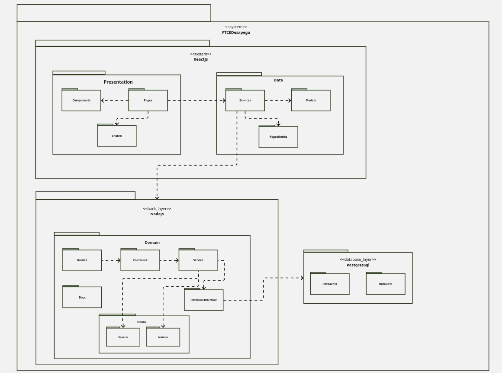
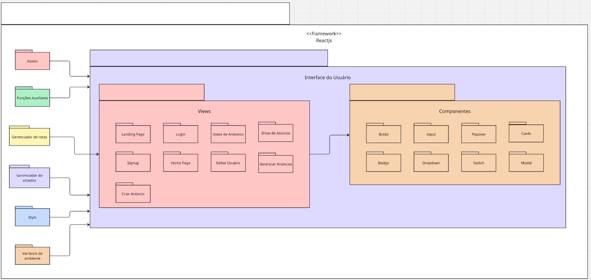
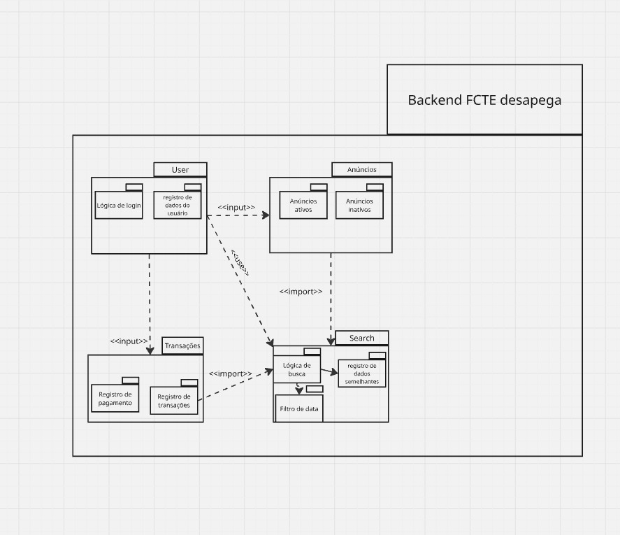
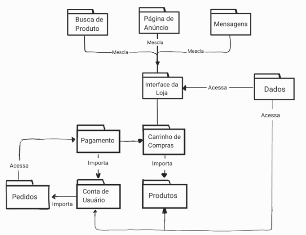

# 2.3.1.DiagramaDePacotes

## Introdução
O diagrama de pacotes é um dos diagramas estruturais da UML (Unified Modeling Language), utilizado para representar a decomposição de um sistema em pacotes lógicos. Cada pacote pode agrupar classes, interfaces e outros elementos relacionados, facilitando a organização modular do sistema. O diagrama mostra as dependências entre pacotes, indicando quais partes do sistema utilizam ou estão vinculadas a outras, o que contribui para uma visão clara da arquitetura em alto nível.

Esse tipo de diagrama é especialmente útil durante a fase de modelagem de sistemas complexos, pois permite identificar acoplamentos indesejados, promover a separação de responsabilidades e definir fronteiras claras entre módulos.

## Metodologia
A partir dos requisitos que foram levantados pela equipe e também a partir do protótipo de alta fidelidade feito por Carla de Araujo, os alunos Daniela, Carla, Davi, Mariana e Arthur elaboraram os diagramas de atividade. Foram usadas diversas ferramentas durante a elaboração dos diagramas como miro, lucichart, draw.io, entre outros.

## Diagramas

Logo abaixo, segue diagramas de pacotes feitos pelos alunos. 
<!-- 

 -->

<em>Autores(as): <a href="https://github.com/arthur-suares">Arthur Suares</a> e <a href="https://github.com/Marianannn">Mariana Letícia</a>, 2025.</em>

<!--  -->

Diagrama de pacotes do frontend da aplicação. Autora: <a href="https://github.com/ccarlaa">Carla Clementino</a>.

<!--  -->

Diagrama de pacotes do backend da aplicação. Autor: <a href="https://github.com/Jagaima">Davi Nobre</a>.

Diagrama de pacotes funcional. Autora: <a href="https://github.com/danialarcao">Daniela Alarcão</a>.

TESTE

---

## Análise e Resultados

### Arquitetura em Camadas (Frontend, Backend e Banco de Dados)

O diagrama apresenta uma arquitetura em camadas, estruturando um sistema composto por frontend, backend e banco de dados. A organização modular é clara e bem definida:

1. **Camada de Apresentação (Frontend - ReactJS)**:

    O frontend é subdividido em dois pacotes principais:

    - **Presentation**: Abriga os componentes visuais (Components), as páginas (Pages) e um pacote compartilhado (Shared). Essa estrutura facilita a reutilização e a organização de elementos comuns entre as páginas.

    - **Data**: Responsável pelo gerenciamento de dados, incluindo Services, Models e Repositories. A comunicação entre Services e Repositories demonstra a separação entre a lógica de negócios e o acesso aos dados.

2. **Camada de Domínio (Backend - NodeJS)**:

    A camada de backend está organizada em torno da lógica de domínio (Domain), sendo composta por:

    - **Routes**: Define as rotas de acesso à API.

    - **Controller**: Centraliza a lógica de controle, atuando como intermediário entre as rotas e os serviços.

    - **Service**: Implementa a lógica de negócios, interagindo com a interface de acesso ao banco de dados (DataBaseInterface).

    - **Entities**: Define as entidades do sistema, exemplificadas pelos módulos Usuario e Anuncio.

    - **Docs**: Provavelmente contém a documentação da API, o que é uma boa prática para manutenibilidade.

3. **Camada de Banco de Dados (PostgreSQL)**:

    A base de dados está isolada em um pacote específico, contendo:

    - **DataAccess**: Interface para comunicação com o banco de dados.

    - **DataBase**: Definições específicas da estrutura do banco.

4. **Integração entre as camadas**:

    O diagrama utiliza setas tracejadas para representar a comunicação entre as camadas, destacando que a camada de apresentação interage com a camada de domínio, que por sua vez, acessa o banco de dados.

###  Frontend React

O diagrama apresenta a estrutura modular do frontend de um e-commerce desenvolvido em React, organizado em diferentes pacotes funcionais. A estrutura é dividida em três camadas principais:

1. **Framework - ReactJS**:

    A camada externa destaca o uso do framework React como base para a aplicação, evidenciando que todos os pacotes internos dependem dessa estrutura.

2. **Interface do Usuário**:

    Esta camada contém os pacotes de Views e Componentes.

    - **Views**: Responsável por abrigar as páginas principais do sistema, como Landing Page, Login, Signup, Home Page, Criar Anúncio, Index de Anúncios, Show de Anúncio, Editar Usuário e Gerenciar Anúncios. Essa organização facilita a manutenção e o desenvolvimento, segregando cada funcionalidade em seu próprio módulo.

    - **Componentes**: Reúne elementos reutilizáveis como Botão, Input, Badge, Dropdown, Switch, Popover, Cards e Modal. Essa estrutura modular contribui para a coesão e reusabilidade do código.

3. **Pacotes Auxiliares**:

    - **Assets**: Gerencia recursos estáticos, como imagens e ícones.

    - **Funções Auxiliares**: Contém funções utilitárias que podem ser utilizadas em diferentes partes do sistema.

    - **Gerenciador de Rotas**: Centraliza a lógica de navegação, facilitando a organização e manutenção das rotas da aplicação.

    - **Gerenciador de Estados**: Implementa a lógica de gerenciamento de estados, essencial para o controle do fluxo de dados entre componentes.

    - **Style**: Mantém as definições de estilos, possivelmente integrando bibliotecas como Tailwind ou Styled Components.

    - **Variáveis de Ambiente**: Centraliza as configurações sensíveis e específicas do ambiente de execução.

###  Backend NodeJS

O diagrama ilustra a estrutura modular do backend da aplicação FCTE Desapega, destacando os principais pacotes e suas respectivas responsabilidades:

1. **Pacote User**:

    Esse pacote gerencia a lógica relacionada ao usuário. Ele contém dois módulos principais:

    - **Lógica de login**: Gerencia autenticação e controle de acesso.

    - **Registro de dados do usuário**: Responsável por armazenar e atualizar as informações cadastrais.

2. **Pacote Anúncios**:

    Esse pacote é dedicado à gestão de anúncios, sendo dividido em:

    - **Anúncios ativos**: Contém a lógica para anúncios em andamento.

    - **Anúncios inativos**: Armazena os anúncios que já foram finalizados ou desativados.

3. **Pacote Transações**:

    Esse pacote é responsável pela lógica de transações financeiras, incluindo:

    - **Registro de pagamento**: Controle dos pagamentos realizados.

    - **Registro de transações**: Histórico de transações associadas a anúncios e usuários.

4. **Pacote Search**:

    Esse pacote implementa a lógica de busca e filtragem de anúncios.

    - **Lógica de busca**: Responsável pelo mecanismo de pesquisa.

    - **Filtro de data**: Permite restringir a pesquisa por períodos específicos.

    - **Registro de dados semelhantes**: Estrutura que armazena dados relacionados a buscas frequentes ou semelhantes.

5. **Interações e Dependências**:

    O diagrama utiliza setas tracejadas para indicar dependências entre pacotes, como:

    - **Entrada de dados (<< input >>) do módulo User para Transações**.

    - **Importação (<< import >>) da lógica de busca para o pacote Search**.

    - **Relação de dependência entre Anúncios e Search**, onde a lógica de busca consulta os dados dos anúnc

## Referências

> UNIVERSIDADE DE BRASÍLIA. Diagrama de pacotes. 2019. Disponível em: https://2019-2-arquitetura-desenho.github.io/wiki/dinamica_seminario_III/diagrama_pacotes/. Acesso em: 08 maio 2025.

> LUCIDCHART. Diagrama de pacotes UML. Disponível em: https://www.lucidchart.com/pages/pt/diagrama-de-pacotes-uml. Acesso em: 08 maio 2025.

> PROFESSOR PAIVA. Diagrama de Pacotes - UML. YouTube, 2025. Disponível em: https://www.youtube.com/watch?si=LUpYCZUi3h1MNRiQ&v=o4srs54NciI&feature=youtu.be. Acesso em: 08 maio 2025.
---

## Histórico de Versão

    <table>
        <tr>
            <th>Data</th>
            <th>Versão</th>
            <th>Descrição</th>
            <th>Autor</th>
            <th>Data da Revisão</th>
            <th>Revisor</th>
            <th>Descrição de Revisão</th>
        </tr>
        <tr>
            <td>08/05/2025</td>
            <td>1.0</td>
            <td>Acrescentando diagrama de pacotes feitos por Arthur e Mariana</td>
            <td><a href="https://github.com/arthur-suares">Arthur Suares</a> <a href="https://github.com/Marianannn">Mariana Letícia</a></td>
            <td>08/05/2025</td>
            <td><a href="https://github.com/arthur-suares">Arthur Suares</a></td>
            <td>Foi revisado o diagrama de pacotes da dupla que faço parte, seu posicionamento no documento e se era possível acessa-lo</td>
        </tr>
                <tr>
            <td>08/05/2025</td>
            <td>1.0</td>
            <td>Adicão do diagrama de pacotes do frontend e backend</td>
            <td><a href="https://github.com/ccarlaa">Carla Clementino</a> e <a href="https://github.com/Jagaima">Davi Nobre</a></td>
            <td>08/05/2025</td>
            <td><a href="https://github.com/danialarcao">Daniela Alarcão</a></td>
            <td>Foi revisado o diagrama de pacotes do frontend e backend da dupla Carla e Davi.</td>
        </tr>
        <tr>
            <td>08/05/2025</td>
            <td>1.0</td>
            <td>Adicão da análise e resultados dos diagramas de pacotes</td>
            <td><a href="https://github.com/ccarlaa">Carla Clementino</a></td>
            <td>08/05/2025</td>
            <td><a href="https://github.com/danialarcao">Daniela Alarcão</a></td>
            <td>Foi revisada a análise de resultados elaborada pela Carla Clementino.</td>
        </tr>
          <tr>
            <td>08/05/2025</td>
            <td>1.1</td>
            <td>Adição de introdução, metodologia e diagrama de pacotes funcional.</td>
            <td><a href="https://github.com/danialarcao">Daniela Alarcão</a></td>
            <td>08/05/2025</td>
            <td><a href="https://github.com/danialarcao">Daniela Alarcão</a></td>
            <td>Revisada a correta disposição do diagrama no documento.</td>
        </tr>
        

    </table>

