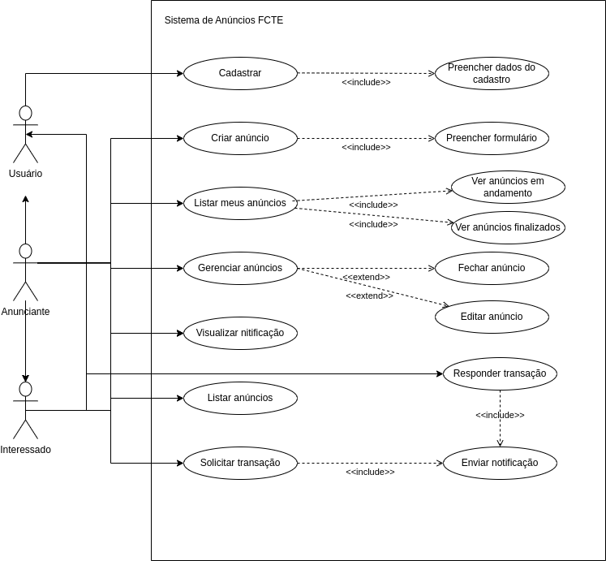
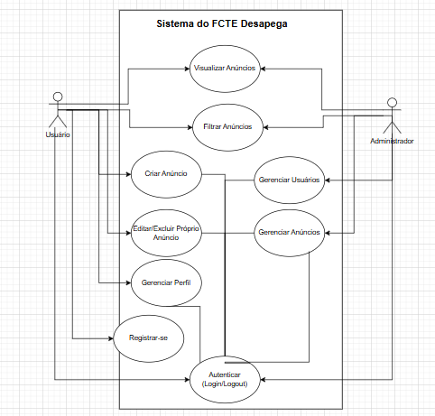

# 2.3.2.DiagramaDeCasosDeUso
## Introdução

O diagrama de casos de uso é uma representação gráfica das interações entre os usuários (atores) e o sistema, destacando as funcionalidades que o sistema oferece. Este diagrama é fundamental para entender os requisitos funcionais do sistema e como os usuários interagem com ele.

## Metodologia

Para a criação do diagrama de casos de uso, seguimos os seguintes passos:

1. **Identificação dos Atores**: Identificamos todos os tipos de usuários que interagem com o sistema.
2. **Definição dos Casos de Uso**: Listamos as funcionalidades que o sistema deve oferecer aos atores.
3. **Relacionamento entre Atores e Casos de Uso**: Estabelecemos as interações entre os atores e os casos de uso, utilizando relações de inclusão e extensão quando necessário.
4. **Revisão e Validação**: O diagrama foi revisado para garantir que todos os casos de uso e atores foram corretamente identificados e representados.

## Diagramas
Logo abaixo se encontram os diagramas de caso de uso realizados.

**Figura 1: Diagrama 1 Caso de Uso**

*Autores(as): [Eduarda Tavares](https://github.com/erteduarda) e [Renata Quadros](https://github.com/RenataKurzawa), 2025* 

[🎥 Vídeo da realização do diagrama de caso de uso: Eduarda e Renata](https://unbbr.sharepoint.com/:v:/s/Arquiteturaedesenhodesoftwaregrupo06/EYG2diKPQ_RIrrVEyrzyGXkBHkxT_evuExJ0OAGPbW6spA?e=3Z6OcK)

**Figura 2: Diagrama 2 Caso de Uso**

*Autor: [Gabriel Monteiro](https://github.com/GabrielSMonteiro), 2025* 

[Link do documento](https://drive.google.com/file/d/1flxmuE-MIX8VfMcYz7a2IpmyZrQ3lhRx/view?usp=drive_link)

**Figura 3: Diagrama 3 Caso de Uso**

*Autores(as): [Karolina Vieira](https://github.com/Karolina91) e [Paola Nascimento](https://github.com/paolaalim), 2025* 

[🎥 Vídeo da realização do diagrama de caso de uso: Karolina e Paola](https://unbbr.sharepoint.com/sites/IHC_reunies/Documentos%20Compartilhados/General/Recordings/Reuni%C3%A3o%20em%20_General_-20250508_212403-Grava%C3%A7%C3%A3o%20de%20Reuni%C3%A3o.mp4?web=1&referrer=Teams.TEAMS-WEB&referrerScenario=MeetingChicletGetLink.view)

## Análise de Resultados

O diagrama de casos de uso do Sistema de Anúncios FCTE destaca as principais funcionalidades oferecidas aos usuários, anunciantes e interessados. As funcionalidades incluem cadastrar, criar anúncio, listar anúncios, gerenciar anúncios, visualizar notificações, e solicitar transações. As relações de inclusão e extensão ajudam a detalhar as interações e dependências entre os casos de uso, proporcionando uma visão clara das operações do sistema.

## Referências Bibliograficas

> 1. Booch, G., Rumbaugh, J., & Jacobson, I. (2005). Unified Modeling Language User Guide. Addison-Wesley Professional.
> 2. Fowler, M. (2004). UML Distilled: A Brief Guide to the Standard Object Modeling Language. Addison-Wesley Professional.

## Histórico de Versão

    <table>
        <tr>
            <th>Data</th>
            <th>Versão</th>
            <th>Descrição</th>
            <th>Autor</th>
            <th>Data da Revisão</th>
            <th>Revisor</th>
            <th>Descrição de Revisão</th>
        </tr>
        <tr>
            <td>08/05/2025</td>
            <td>1.0</td>
            <td>Acrescentando diagrama de caso de uso feito por Renata e Eduarda; adicionando link da gravação fazendo o diagrama</td>
            <td><a href="https://github.com/RenataKurzawa">Renata Quadros</a> <a href="https://github.com/erteduarda">Eduarda Tavares</a></td>
            <td>08/05/2025</td>
            <td><a href="https://github.com/RenataKurzawa">Renata Quadros</a></td>
            <td>Foi revisado o diagrama de caso de uso da dupla que faço parte, seu posicionamento no documento e se era possível acessa-lo</td>
        </tr>
        <tr>
            <td>08/05/2025</td>
            <td>1.1</td>
            <td>Acrecentando introdução, metodologia e análise</td>
            <td><a href="https://github.com/RenataKurzawa">Renata Quadros</a> <a href="https://github.com/erteduarda">Eduarda Tavares</a></td>
            <td>08/05/2025</td>
            <td><a href="https://github.com/erteduarda">Eduarda Tavares</a></td>
            <td>Foi revisado o diagrama de caso de uso da dupla que faço parte, seu posicionamento no documento e se era possível acessa-lo</td>
        </tr>
        <tr>
            <td>08/05/2025</td>
            <td>1.2</td>
            <td>Acrescentando segundo diagrama de caso de uso</td>
            <td><a href="https://github.com/GabrielSMonteiro">Gabriel Monteiro</a></td>
            <td>08/05/2025</td>
            <td><a </a></td>
            <td></td>
        </tr>
        <tr>
            <td>08/05/2025</td>
            <td>1.3</td>
            <td>Acrescentando terceiro diagrama de caso de uso</td>
            <td><a href="https://github.com/paolaalim">Paola Nascimento</a></td>
            <td>08/05/2025</td>
            <td><a </a></td>
            <td></td>
        </tr>
    </table>

