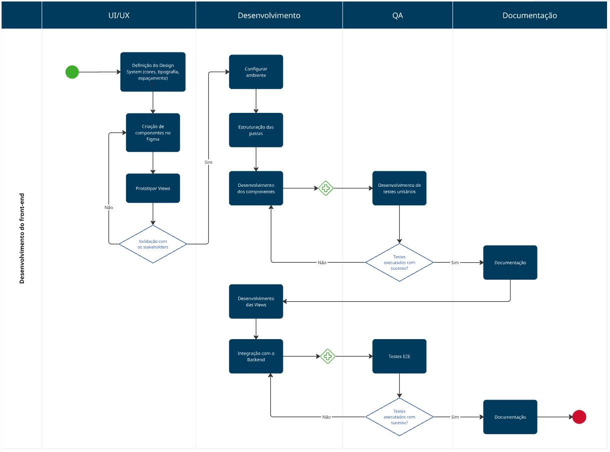
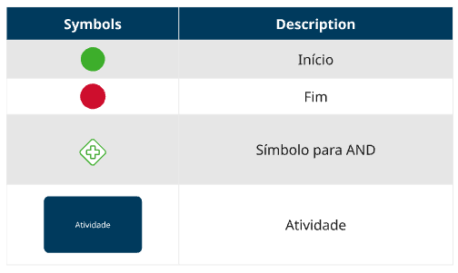

# BPMN - Desenvolvimento Frontend

## Introdução

O Business Process Modeling Notation (BPMN) é uma notação amplamente utilizada para modelar processos de negócio, oferecendo uma representação visual padronizada que facilita o entendimento e a comunicação entre as partes interessadas. No contexto do desenvolvimento frontend em React, o BPMN foi utilizado para estruturar o fluxo de atividades, desde a concepção do design até a implementação final dos componentes. A aplicação dessa notação visa organizar o processo de desenvolvimento, permitindo identificar etapas críticas, otimizar tarefas e garantir a consistência na entrega dos artefatos.

## Metodologia

O processo de desenvolvimento frontend em React foi estruturado com base no diagrama BPMN elaborado, que visa organizar e sequenciar as atividades essenciais do fluxo de trabalho. A metodologia adotada foi a iterativo-incremental, permitindo a entrega gradual de componentes e funcionalidades enquanto o projeto avança.

O diagrama foi dividido em etapas principais que representam desde a definição dos requisitos até a implementação e validação dos componentes. Cada etapa foi planejada considerando as características do ambiente React, priorizando a modularização do código e a reutilização de componentes.

Para garantir a consistência e a qualidade do código, foram estabelecidos ciclos de revisão e testes intermediários, alinhados com os sprints definidos no planejamento. Essa abordagem permitiu integrar feedbacks de forma contínua, evitando retrabalho e assegurando a entrega de um frontend robusto e funcional.

## Diagrama

<em>Diagrama BPMN - Frontend. Autora: Carla Clementino.</em>

<em>Diagrama BPMN - Frontend - Legenda. Autora: Carla Clementino.</em>

## Histórico de Versão

    <table>
        <tr>
            <th>Data</th>
            <th>Versão</th>
            <th>Descrição</th>
            <th>Autor</th>
            <th>Data da Revisão</th>
            <th>Revisor</th>
            <th>Descrição de Revisão</th>
        </tr>
        <tr>
            <td>08/05/2025</td>
            <td>1.0</td>
            <td>Criação do documento</td>
            <td><a href="https://github.com/'ccarlaa'">Carla Clementino</a></td>
            <td>00/00/0000</td>
            <td><a href="https://github.com/Jagaima"> Davi Nobre </a></td>
            <td>Analisei as inciativas extras feitas pela Carla, o bpmn parece estar nos conformes com o que foi feito entrega passada e é uma ótima adição. Não encontrei partes necessárias de se sofrer edição, deixando o documento inalterado mas revisado por outro integrante </td>
        </tr>
    </table>

